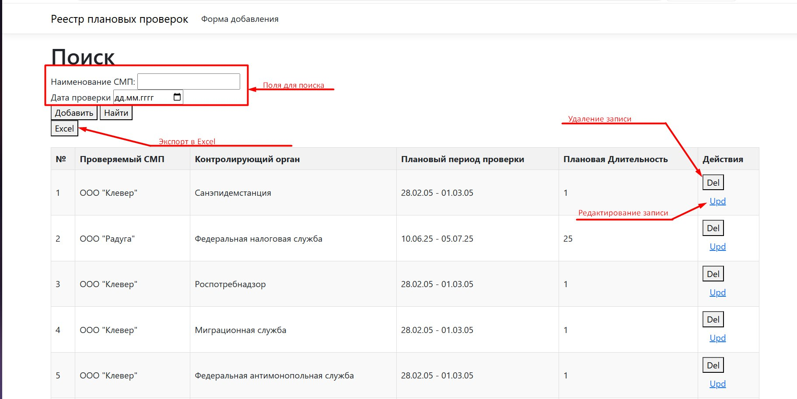
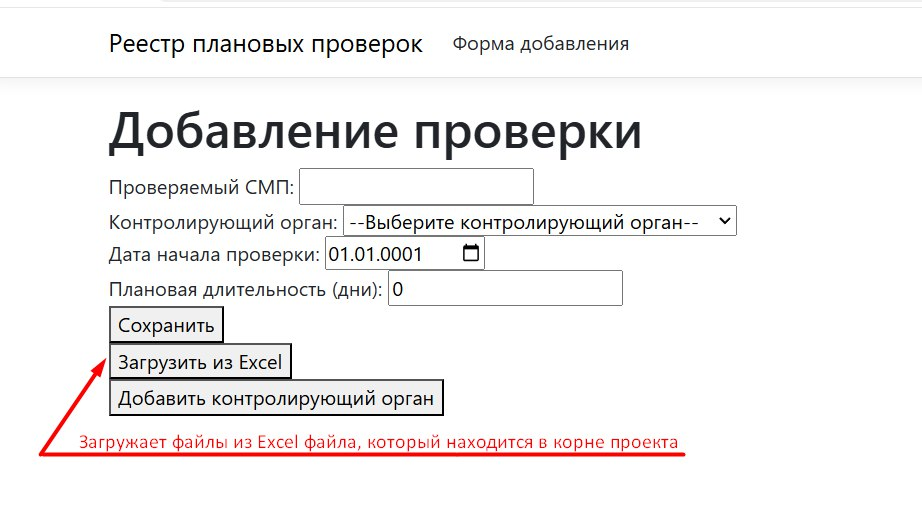
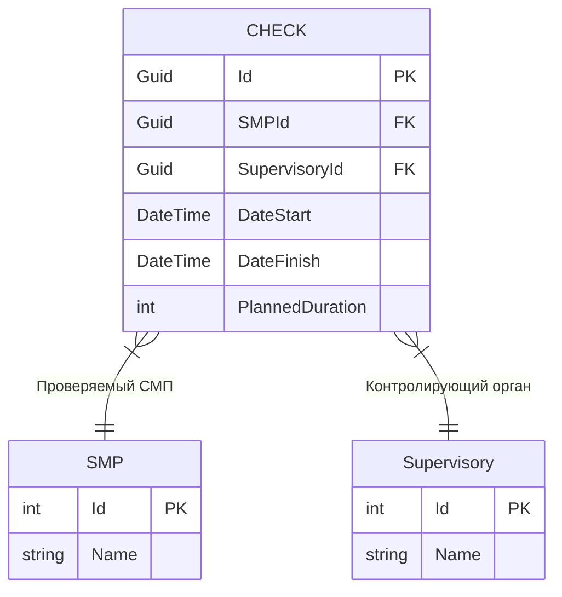

# Реестр плановых проверок СМП

Проект для учета и управления плановыми проверками субъектов малого предпринимательства (СМП).  
Разработан на **ASP.NET Core Razor Pages** с использованием **MSSQL** и **Entity Framework Core**.

## 🛠 Технологии
- **Backend**: ASP.NET Core
- **Database**: MSSQL (Docker)
- **ORM**: Entity Framework Core
- **Дополнительно**: Экспорт в Excel, валидация форм

## 🚀 Запуск проекта

### Предварительные требования
- Установленный [Docker](https://www.docker.com/)


### Инструкция
1. Запустите контейнер с БД:
   ```bash
   docker-compose up -d
   ```


2. Установка EntityFramework
    ```bash
    dotnet tool install --global dotnet-ef
    ```

3. Применяем миграции
    ```bash
    dotnet ef database update
    ```

### Приложение готово к запуску.
___
## Обзор проекта

### 📸 Скриншоты

Главная страница



Таблица проверок с поиском и действиями
___
Добавление проверки



Форма с валидацией и привязкой к СМП/органам
___

## ✨ Функционал
+ CRUD-операции с проверками
+ Поиск по:
    + Названию СМП
    + Дате проверки
+ Импорт данных в Excel (одна проверка или весь реестр)
+ Экспорт данных в Excel
+ Управление справочниками:
    + Добавление новых контролирующих органов

## 🗃 Структура БД
### Основные сущности:


